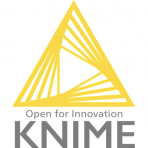
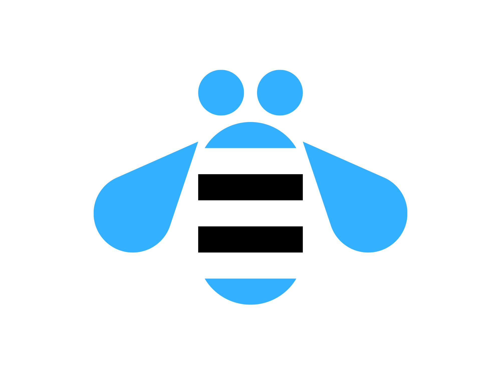

# Hello

  

Hello to my mini README; first of all, my golden rule is ***"Be the change that you want to see in the world"***.

I am passionate about the sea of data science and artificial intelligence; in fact, I am taking a ***Master's degree in Artificial Intelligence*** at Universidad Internacional de la Rioja (UNIR). Besides, I am taking too deep learning specialization Coursera.

In addition, I've worked as Business Intelligence Consultant, Python Developer and Data Engineering.
 
 

*Visit my [live-cv](https://juans3.github.io) for more information*
# Technical skills

## PROGRAMMING LANGUAGES & TOOLS
  -  Python - Anaconda - Django
  -  R
  -  SQL - NoSQL
  -  Git - GitHub and GitLab
  -  Bash - Batch
  -  GNU/Linux
  -  HTML
  -  JavaScript
  -  Java

## OTHER TOOLS
  -  KNIME Analytics Platform
  -  Qlik Sense
  -  Microsoft Power BI - M Language
  -  IBM Cognos - Decision Stream - DataManager - DataStage

## DATASCIENCE LIBRARIES (PYTHON)
  -  Pandas
  -  Matplotlib
  -  Seaborn
  -  NumPy
  -  Scikit Learn
  -  Scikit Image
  -  Scipy
  -  TensorFlow
  -  Keras
  -  Spark

# Contact

<a href="https://t.me/JuanS3">
   t.me/JuanS3
</a>

 

<a href="https://www.linkedin.com/in/jsebastian-martinez">
   linkedin.com/in/jsebastian-martinez/
</a>

 

<a href="https://juans3.github.io">
   juans3.github.io
</a>
